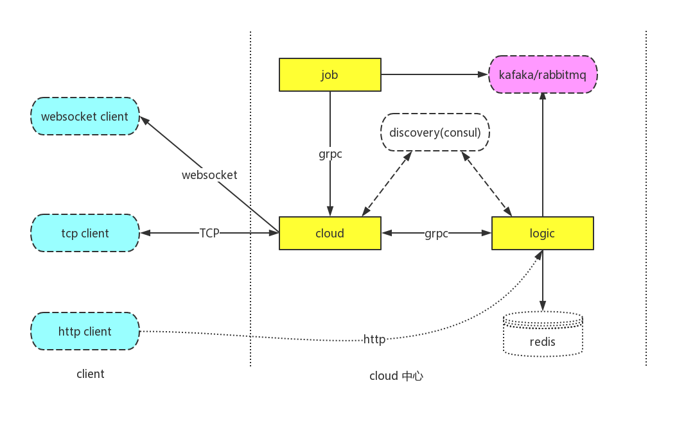
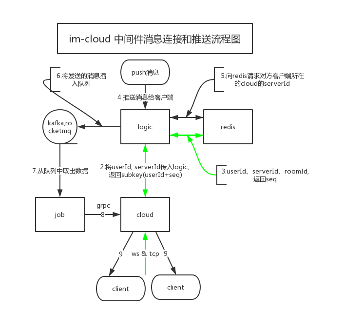
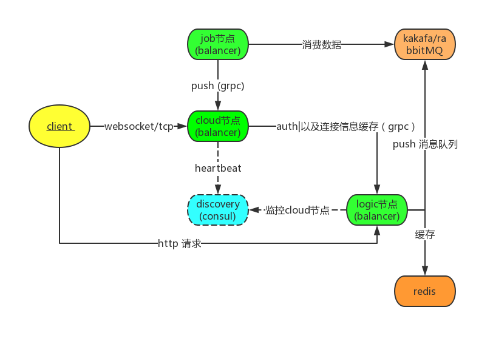

    

  
  

基于原生 swoole 全协程化构建 im-cloud中间件，多节点扩容

## 概述
+ 基于`swoole`原生商业化即时推送im服务,不进行业务处理，单独作为中间件使用，可弹性扩充节点增加性能处理,业务demo:(todo)
+ 高性能 水平扩容 分布式服务架构 接入服务治理
+ [`cloud`](./app/cloud) 作为中心服务节点 `grpc-server` 节点，对外可以进行TCP、Websocket 客户端进行`长连接`,可以对水平扩容至多个节点 并注册到服务中心 例如`consul`，每个cloud节点维护自己的客户端
+ [`job`](./app/-job) 节点作为消费节点 消费队列数据 然后进行`grpc` 和cloud服务进行通讯 进行 `push` `push room` `broadcast`,作为节点中间件，消费`kafaka`，`rockermq。。。`之类
+ [`logic`](./app/logic) 节点 提供rest api接口，作为生产节点 和  grpc客户端,可写入队列作为生产者，也可以扩展自己的业务进行rpc直接调用center中心进行推送
+ `cloud,job,logic` 等节点都可以水平扩容

架构图
=========
im-cloud 连接流程图
----

im-cloud 数据流程图
-----

im-cloud 业务流程
-----

服务处理
------
todo

## 组件依赖
> 相关组件为纯swoole实现
### @[core](pkg/core) (done) 核心架构
### @[grpc](pkg/grpc) (done) grpc包依赖 grpc-client连接池
### @[discovery](pkg/discovery) (done) 服务发现注册
### @[process](pkg/process)(done) 自定义进程管理器
### @[redis](pkg/redis)(done) redis连接池
### @[queue](pkg/queue)(done amqp,soon kafak) 消息队列连接池
### @[task](pkg/task)(done) 异步任务投递组件
### @[cloud](./app/cloud) (test verion)
### @[job](./app/job)   (test version)
### @[logic](./app/logic) (test version)

## 相关文档
- [im-cloud 基于swoole 原生协程构建分布式推送中间件](./docs)
- [im-cloud 分布式中间件的安装部署](./docs)
- [im-cloud <> goim 分布式中间件并发压测对比 ](./docs)
- [im-cloud分布式中间件分析(一)-通讯协议](./docs)
- [im-cloud分布式中间件分析(二)-cloud节点实现](./docs)
- [im-cloud分布式中间件分析(三)-job节点实现](./docs)
- [im-cloud分布式中间件分析(四)-logic节点实现](./docs)

## 📝 License

Copyright © 2019 [brewlin](https://github.com/brewlin). 
This project is [MIT](https://github.com/brewlin/im-cloud/LICENSE) licensed.

