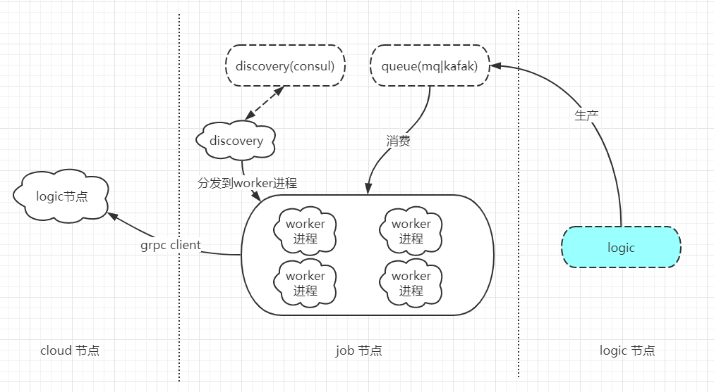

# im-cloud分布式中间件分析-job节点实现

## 1.概述
> job 节点 作为消费端，消费logic生产的数据，然后通过grpc推送至cloud节点，cloud点真正处理客户端数据，job节点默认多进程消费启动4个worker进程，以及默认10个grpc连接池
- 数据流程图



## 2.@Consumer 消费中心
> 默认启动4个worker进程消费logic请求，耗时处理投放至task进程处理，并转发至cloud节点
### 监听worker启动事件
需要在`config/queue.php` ,`config/event.php` 注册相应的事件和相关配置
```
use App\Consumer\Consumer;
use Core\App;
use Core\Swoole\WorkerStartInterface;
use Swoole\Server as SwooleServer;

class WorkerStartListener implements WorkerStartInterface
{
    const INIT_LOGIC = 1;

    public function onWorkerStart(SwooleServer $server, int $workerId): void
    {
        if(App::isWorkerStatus()){
            //启动的n个 worker进程 分别作为消费者进程消费，每个进程会直接阻塞直到消费到数据
            consumer()->consume(new Consumer());
        }
    }

}
```
### 消费主流程
- 1.为每个消费数据请求建立一个协程，处理相关数据
- 2.将每个数据投递至worker进程进行真正的grpc与cloud推送请求
```
Co::create(function()use($data){
    if(empty(CloudClient::$table->getAllInstance())){
        Log::error("cancle task deliver discovery cloud node is empty");
        return;
    }
    Task::deliver(Job::class,"push",[$data]);
},false);
return Result::ACK;
```
- 3.通过以上做法能加快并发是消费速度，task进程也进行协程处理，增加并行处理能力，如果task进程阻塞也会造成task任务投递阻塞，所以在worker进程也需要加一个协程处理
