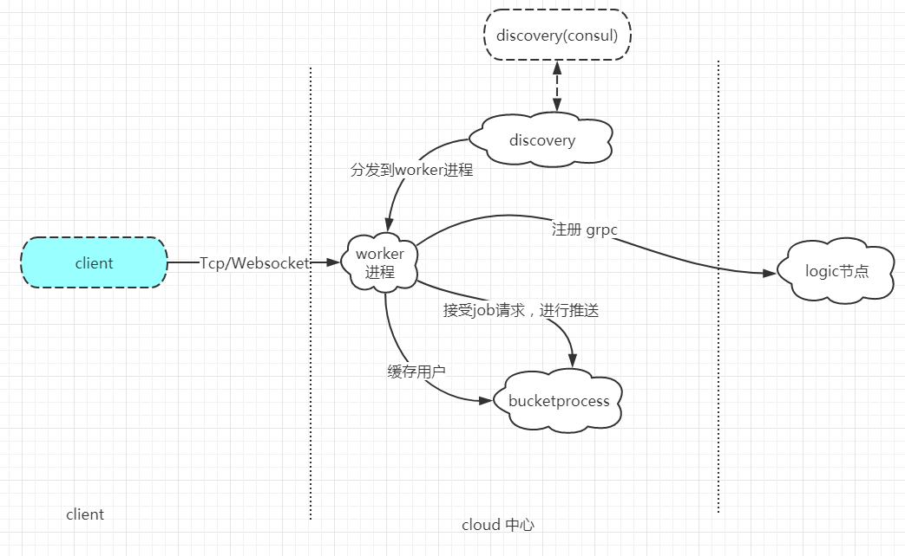

# im-cloud分布式中间件分析-cloud节点实现

## 1.概述
> cloud 节点对外提供`websocket`、`tcp` client 注册。并维护每个连接对应的客户端信息。作为Grpc server，接受grpc推送数据，并推送到client端
- 数据流程图



## 2.@Grpc server
> grpc server 基于swoole 的`http2`协议，然后通过config/router.php 配置项注册路由既可以使用如rest模式下的交互流程
### grpc 路由注册
> 配置文件 `config/router.php`
```php
<?php
//Grpc server router
HttpRouter::post('/im.cloud.Cloud/Ping', '/Grpc/Cloud/ping');
HttpRouter::post('/im.cloud.Cloud/Close', '/Grpc/Cloud/close');
HttpRouter::post('/im.cloud.Cloud/PushMsg', '/Grpc/Cloud/pushMsg');
HttpRouter::post('/im.cloud.Cloud/Broadcast', '/Grpc/Cloud/broadcast');
HttpRouter::post('/im.cloud.Cloud/Rooms', '/Grpc/Cloud/rooms');
```
和rest 路由一样只需要注册路由到对应的方法即可，当使用grpc-client进行请求时，就能分发到最远的控制器去，
### grpc 参数解析
> 当接收到请求后，可以根据协程上下文获取当前连接的请求参数，`grpc`传输的协议是二进制，所以不能通过get，post方法直接获得对应的参数，需要采用grpc提供的方法进行解包
```php
use Grpc\Parser;
use Core\Context\Context;
public function pushMsg()
{
    $rawbody = Context::get()->getRequest()->getRawBody();
    /** @var PushMsgReq $pushMsgReq */
    $pushMsgReq = Parser::deserializeMessage(
            [PushMsgReq::class,null],
            $rawbody
    );
}
```
- 获取请求参数可以通过协程上下文获取
    - `Context::get()->getRequest()->getRawBody();`
    - `request()->getRawBody();`
- `Grpc\Parser` 方法使用的是 swoole\grpc-client 组件包提供的方法，使用swoole对原生grpc 进行了封装
## 3.@websocket server
> 基于websocket 协议注册到cloud节点，cloud 进行认证，通过grpc将注册信息传递到logic统一管理，认证成功后cloud节点将保存改连接的基础信息
### 握手阶段
> 命名空间：`App/Websocket/HandshakeListener.class`

该事件为swoole 监听事件，所以需要注册监听回调函数,配置文件为`config/event.php`
```
use \Core\Swoole\SwooleEvent;
use \App\Websocket\HandshakeListener;

return [
    //websocket握手事件
    SwooleEvent::HANDSHAKE        => new HandshakeListener(),
];
```
接下来是握手流程
```
    /**
     * token check '{"mid":123, "room_id":"live://1000", "platform":"web", "accepts":[1000,1001,1002]}'
     * @param Request $request
     * @param Response $response
     * @return bool
     */
    public function onHandshake(Request $request, Response $response): bool
    {
        $httpRequest = HttpRequest::new($request);
        //握手失败
        if($httpRequest->getUriPath() != self::upgradeUrl){
            $response->end();
            return false;
        }
        // websocket握手连接算法验证
        $secWebSocketKey = $request->header['sec-websocket-key'];
        $patten = '#^[+/0-9A-Za-z]{21}[AQgw]==$#';
        if (0 === preg_match($patten, $secWebSocketKey) || 16 !== strlen(base64_decode($secWebSocketKey))) {
            $response->end();
            return false;
        }
        $key = base64_encode(sha1(
            $request->header['sec-websocket-key'] . '258EAFA5-E914-47DA-95CA-C5AB0DC85B11',
            true
        ));

        $headers = [
            'Upgrade' => 'websocket',
            'Connection' => 'Upgrade',
            'Sec-WebSocket-Accept' => $key,
            'Sec-WebSocket-Version' => '13',
        ];

        // WebSocket connection to 'ws://127.0.0.1:9502/'
        // failed: Error during WebSocket handshake:
        // Response must not include 'Sec-WebSocket-Protocol' header if not present in request: websocket
        if (isset($request->header['sec-websocket-protocol'])) {
            $headers['Sec-WebSocket-Protocol'] = $request->header['sec-websocket-protocol'];
        }

        foreach ($headers as $key => $val) {
            $response->header($key, $val);
        }
        $response->status(101);
        $response->end();
        return true;
    }
```
该方法在握手阶段对于http请求进行校验，如果路径不为 '/sub' 则认证失败关闭连接，成功后校验websocekt协议并升级为websocket，
### 主事件处理
> 同样需要注册websocket的onmessage事件 配置文件:`config/envent.php`
#### @step1 解包
> 使用 `App\Packet\Packet::class` 进行解包，
通讯协议为二进制传输，会有单独一章分析im-cloud通讯协议的设计
#### @step2 处理分发(注册)
> 根据协议，如果为注册请求，则进行注册流程，心跳则进行心跳流程
`im-cloud暂时不支持双向推送，也就是该连接不支持接受推送消息，推送请走logic节点push`
### @step3 注册
- 1.进行auth参数校验
- 2.通过grpc 注册到logic节点
```php
$server = LogicClient::getLogicClient();
if(empty($server))
    throw  new \Exception("not find any logic node");
$connectReq = new ConnectReq();
/** @var \Im\Logic\LogicClient $rpcClient */
$rpcClient  = null;
$serverId = env("APP_HOST","127.0.0.1").":".env("GRPC_PORT",9500);
$connectReq->setServer($serverId);
$connectReq->setCookie("");
$connectReq->setToken(json_encode($data));
/** @var ConnectReply $rpy */
$rpy = GrpcLogicClient::Connect($server,$connectReq)[0];
```
- 3.注册成功后将当前用户信息 写入bucket进程，独立维护所有的用户信息和连接
```

[$mid,$key,$roomId,$accepts,$heartbeat] = $this->registerLogic($body);
/** @var Task $task */
\bean(Task::class)->deliver(Bucket::class,"put",[$roomId,$key,$fd]);
```
## 4.@tcp server
> tcp 处理流程和websocket大致相似，走同样的流程,只是监听对应的api有些区别

## 5.自定义进程
cloud节点 默认启动了两个自定义进程伴随swoole启动而启动

### discoveryProcess 注册发现进程
> 该进程 在启动时注册到 注册中心(默认consul，可以扩展其他的注册中心),然后进行事件轮训，获取健康状态的实例节点
- 配置文件
    - `config/process.php` 注册进程到进程管理器
    - `config/consul.php`  配置发现中心的配置
- 获取到实例节点后 更新swoole所有的worker进程里的实例节点信息使用`sendMessage()`进行进程间通信
```php
/**
* 自定义子进程 执行入口
* @param Process $process
*/
public function run(Process $process)
{
    provider()->select()->registerService();
    $config = config("discovery");
    $discovery = $config["consul"]["discovery"]["name"];
    while (true){
        $services = provider()->select()->getServiceList($discovery);
        if(empty($services)){
            CLog::error("not find any instance node:$discovery");
            goto SLEEP;
        }
        for($i = 0; $i < (int)env("WORKER_NUM",4);$i++)
        {
            //将可以用的服务同步到所有的worker进程
            Cloud::server()->getSwooleServer()->sendMessage($services,$i);
        }
SLEEP:
        sleep(10);
    }
}
```

### bucketProcess    用户缓存池
> 配置文件 `config/process.php` 注册该进程

该进程两个任务:
- 1 注册成功后缓存用户信息，管理用户连接
```php
//step 1
[$mid,$key,$roomId,$accepts,$heartbeat] = $this->registerLogic($body);
//step 2
/** @var Task $task */
\bean(Task::class)->deliver(Bucket::class,"put",[$roomId,$key,$fd]);
使用deliver进程间通信，发送到bucketProcess进程处理
```
- 2.作为主要的推送进程
> 当cloud节点grpcserver 接收到推送请求，则创建一个协程写入bucketprocess进程，当前进程消费管道里的数据，每个数据创建一个协程，处理推送问题

- 3.使用自定义进程管理用户信息的选择
```
出版采用的redis缓存用户信息，在实际压测的时候发现即使是redis缓存还是会影响并发处理。
导致慢了4-5倍，而采用自定义进程处理的好处有如下两点，多进程下对数据不需要加锁。针对每个请求单独创建一个协程反而效率要高些
```

## 5.监听事件，生命周期管理
> swoole 相关生命周期执行管理都依赖监听事件，例如 `进程启动` `请求事件` `握手连接` `关闭连接` 等等。。
```php
/**
 * set event to base swoole
 * 给swoole 设置基础的监听事件，
 */
use \Core\Swoole\SwooleEvent;
use \App\Event\PipeMessageListener;
use \App\Event\WorkerStopListener;
use \App\Event\ShutdownListener;
use \App\Websocket\MessageListener;
use \App\Websocket\HandshakeListener;
use App\Tcp\ReceiveListener;
use App\Event\OnCloseListener;
use App\Event\WorkerStartListener;

return [
    //监听onpipmessage事件
    SwooleEvent::PIPE_MESSAGE => new PipeMessageListener(),
    
    //监听进程启动事件
    SwooleEvent::WORKER_START => new WorkerStartListener(),
    
    //监听进程关闭事件
    SwooleEvent::WORKER_STOP  => new WorkerStopListener(),
    SwooleEvent::SHUTDOWN     => new ShutdownListener(),

    //监听tcp事件
    SwooleEvent::RECEIVE      => new ReceiveListener(),

    //监听websocket 事件
    SwooleEvent::MESSAGE      => new MessageListener(),
    //websocket握手事件
    SwooleEvent::HANDSHAKE    => new HandshakeListener(),

    //server监听关闭连接事件然后grpc通知logic销毁连接信息
    SwooleEvent::CLOSE        => new OnCloseListener(),
];
```