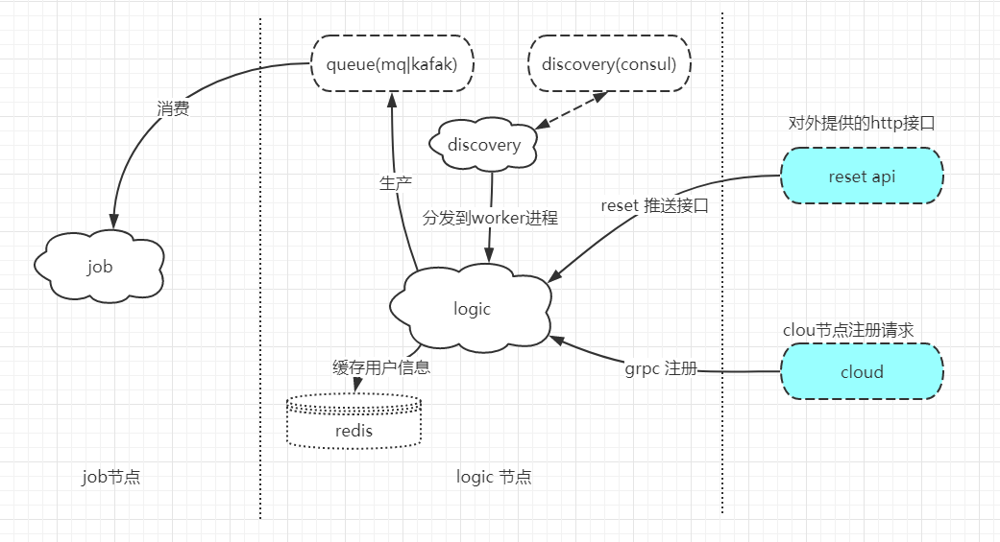

# im-cloud分布式中间件分析-logic节点实现

## 1.概述
> logic 节点 作为生产者和client端，作为业务节点，提供push推送resetapi接口，可以扩容多个节点做nginx负载均衡



## 2.@Producer 
> 默认启动10个消息队列连接池，在task进程为每个人物创建协程异步生产任务
### 异步task任务
直接调用组件task接口进行投递到task进程执行，task投递为非阻塞操作，执行完毕会直接返回，大大的提升了worker处理并发请求的能力，唯一的影响是，如果多个task进程的消费能力更不上worker的投递速度也会影响worker的处理能力，所以需要做取舍
- 具体的消息队列生成在task进程中执行
- task进程启用了协程模式，投递的每个任务都默认创建一个协程

```
use Task\Task;
/**
* @var LogicPush
*/
Task::deliver(LogicPush::class,"pushMids",[(int)$arg["op"],$arg["mids"],$arg["msg"]]);
```
- 相关异步任务 存放在命名空间`App\Task`下

## 相关优化
### 容器化
单个请求流程执行的生命周期会调用生成多个对象，多达10多个。并发大的情况下GC 几乎会首先挂掉，而且会耗时等待，所以new对象也有优化的空间

项目在初始化也就是主进程启动期间就扫描相关代码，有注解的就进行收集，然后实例化到容器container中，以后再多次使用的时候直接复用代码，而无需多次new对象，大大节省空间和时间，如下图为创建一个协程去执行任务，相关的对象都从容器中获取
```
Co::create(function ()use($op,$mids,$msg){
    /** @var RedisDao $servers */
    $servers = \container()->get(RedisDao::class)->getKeysByMids($mids);
    $keys = [];
    foreach($servers as $key => $server){
        $keys[$server][] = $key;
    }
    foreach($keys as $server => $key){
        //丢到队列里去操做，让job去处理
        \container()->get(QueueDao::class)->pushMsg($op,$server,$key,$msg);
    }

},true);
//第二个参数为true 表示使用Context::waitGroup() 等待任务执行完成
```
如上图所示可以调用组件提供的多个方法获取容器对象
- `container()->get(class)`
- `bean(class)`
- 两种都可以获取容器对象，
- 
### 提高并发性能
即使将主要的耗时任务放到task进程中执行，worker进程中依然会有少量的等待时间，现在采取的方式，是请求到来时获取数据后，直接回复结束当前连接，然后在继续执行任务，这样就不用等到投递task任务后再结束当前连接，大大提高并发能力，虽然可能耗时性能没有发生太大的改变，但是并发能力大大的提升。如下所示：
```
    /**
     * @return \Core\Http\Response\Response|static
     */
    public function mids()
    {
        Context::get()->getResponse()->end();
        $post  = Context::get()->getRequest()->input();
        if(empty($post["operation"]) || empty($post["mids"]) ||empty($post["msg"])){
            return $this->error("缺少参数");
        }
        $arg = [
            "op" => $post["operation"],
            "mids" => is_array($post["mids"])?$post["mids"]:[$post["mids"]],
            "msg" => $post["msg"]
        ];
        Log::debug("push mids post data:".json_encode($arg));
        /**
         * @var LogicPush
         */
        Task::deliver(LogicPush::class,"pushMids",[(int)$arg["op"],$arg["mids"],$arg["msg"]]);
    }
```
- 如上图直接使用`Context::get()->getResponse()->end();`通过协程上下文获取reponse对象直接结束当前连接，然后在继续执行当前任务，并释放内存
