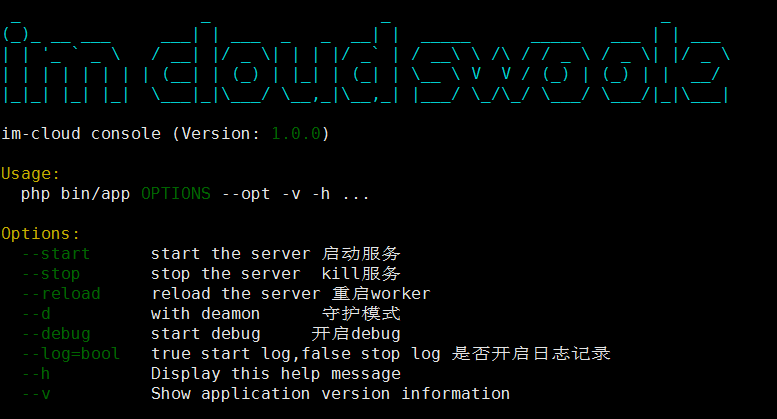

# im-cloud 分布式中间件的安装部署
>github:http://github.com/brewlin/im-cloud
- [im-cloud 基于swoole 原生协程构建分布式推送中间件](./docs)
- `im-cloud 分布式中间件的安装部署`
- [im-cloud <> goim 分布式中间件并发压测对比 ](./docs)
- [im-cloud分布式中间件分析(一)-通讯协议](./docs)
- [im-cloud分布式中间件分析(二)-cloud节点实现](./docs)
- [im-cloud分布式中间件分析(三)-job节点实现](./docs)
- [im-cloud分布式中间件分析(四)-logic节点实现](./docs)

安装方式主要提供 `docker单节点部署` `docker-compose自动化编排部署` `手动部署` 三种方式部署环境

## 一、docker部署
>基础镜像足够小 不用担心  `base image+php7.2+swoole 4 才75M`

docker-compose networknamespace 为host模式，所以需要注意本地端口冲突的问题,也可以根据自己的环境更改compose.yml配置
### 1.docker 单独部署
- 镜像
    - consul
    - redis
    - brewlin/cloud
    - brewlin/job
    - brewlin/logic
- 启动consul
```
docker run --network host consul
```
- 启动redis
```
docker run --network host redis
```
- 启动cloud节点
```
docker run --network host brewlin/cloud
```
- 启动job节点
```
docker run --network host  brewlin/job
```
- 启动logic节点
```
docker run --network host  brewlin/logic
```

### 2.docker-compose 编排服务
```
git clone http://github.com/brewlin/im-cloud
cd im-cloud
docker-compose up
```
## 二、手动部署
### help

### process 

### status

### 环境要求
- swoole 4 +
- php 7.2 +
- console
- rabbitmq
- redis
### 1.安装依赖
make脚本使用composer自动install相关组件
```
cd path/im-cloud
make install
```
### 2.启动cloud节点
```
cd path/im-cloud/app/cloud
php bin/app --start --d --log=true --debug
```
### 3.启动logic节点
```
cd path/im-cloud/app/logic;
php bin/app --start --d --log=true --debug
```
### 4.启动job节点
```
cd path/im-cloud/app/job;
php bin/app --start --d --log=true --debug
```
### @makefile自动工具
```proto
cd im-cloud;
make start
make stop
make restart
```
### 5.安装启动consul
```proto
docker run --network consul
```
### 6.安装rabbitmq
- 1.添加新的源

```
echo 'deb http://www.rabbitmq.com/debian/ testing main' |
     sudo tee /etc/apt/sources.list.d/rabbitmq.list
```
- 2.下载公钥

```
wget -O- https://www.rabbitmq.com/rabbitmq-release-signing-key.asc |
     sudo apt-key add -
```
- 3.更新 & 安装

```
sudo apt-get update
sudo apt-get install rabbitmq-server
```
- 4.修改配置文件

```
cd /etc/rabbitmq/
新建文件
touch rabbitmq.config

在配置文件中加入

[{rabbit, [{loopback_users, []}]}].
```


- 5.状态管理
```
rabbitmqctl status 可查看rabbitmq的状态
```

- 6.开启web管理界面
```shell
# 开启rabbitmq web界面
Host]# rabbitmq-plugins enable rabbitmq_management
    The following plugins have been enabled:
        rabbitmq_web_dispatch
        rabbitmq_management_agent
        rabbitmq_management
```

- 7.创建用户
```
Host]# rabbitmqctl add_user xiaodo xiaodo
    Creating user "admin"
Host]# rabbitmqctl set_user_tags xiaodo administrator
    Setting tags for user "admin" to [administrator]
```
## 三、测试
- 1.使用js sdk 提供的demo 注册到cloud
- 2.post `http://host:9600/im/push/mids?mids=123&operation=9&msg=pushtest` 进行单点推送